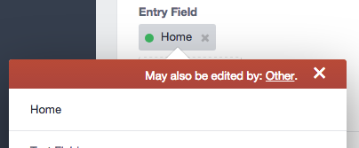

# Snitch plugin for Craft CMS 3.x

Snitch watches entry, category, and global set editors, and lets you know when someone else may also be editing the same thing at the same time.

## Installation

To install Snitch, follow these steps:

1. Download & unzip the file and place the `snitch` directory into your `craft/plugins` directory
2.  -OR- install with Composer via `composer require marionnewlevant/snitch`
3. Install plugin in the Craft Control Panel under Settings > Plugins

Snitch works on Craft 3.x.

## Snitch Overview

Snitch works by injecting a javascript file into backend pages. That javascript looks for an element edit window or
a modal element edit window, and when it detects one, asks the server to report any collisions.

A warning banner appears at the top of the editor pane when someone else may be editing the same element:

A warning banner also appears at the top of editor modals:

Clicking the `X` will dismiss the banner.

## Configuring Snitch

The default configuration can be overridden with a config file in `craft/config/snitch.php`. This is a standard Craft config file, with the usual multienvironment support. The configurable values are:

- `serverPollInterval`: interval (in seconds) for polling server to look for newly arrived conflicts. Default value: `2`
- `message`: text for the warning banner. The text `{user}` will be replace with a mailto link to the conflicting user. Default value: `May also be edited by: {user}.`
- `inputIdSelector`: the css selector for identifying the hidden inputs which indicate an element edit window or modal elment edit window.

The visual look of the warning banners can be modifed with the `cpcss` plugin.

Brought to you by [Marion Newlevant](http://marion.newlevant.com)
